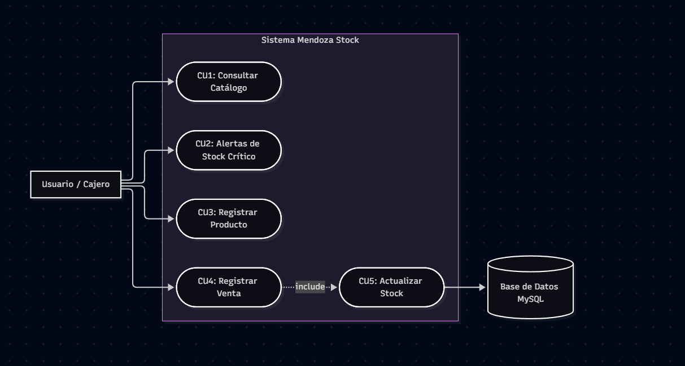

# 📦 Mendoza Stock - Sistema de Gestión de Inventario

#### Universidad Champagnat - Laboratorio de Desarrollo de Software
**Grupo N° 4**
- Thomas Rodríguez
- Brian Exequiel Villalba Gutiérrez
- Juan Ignacio González

---

##  Descripción del Proyecto
La solución propuesta permite digitalizar y centralizar el control de inventario en pequeños comercios, eliminando registros manuales en papel. El sistema agiliza la actualización de existencias, notifica sobre bajo stock y gestiona el catálogo en tiempo real.

---

##  Requisitos Previos

Antes de comenzar, asegúrate de tener instalado en tu computadora:

1. **PHP 8.x** (o mediante un servidor local como **XAMPP** o **WAMP**).
2. **MySQL / MariaDB** (incluido en XAMPP/WAMP).
3. **Git** (para clonar el repositorio).
4. **Navegador Web** (Chrome, Firefox, Edge).

---

##  Guía de Instalación Paso a Paso (Desde Cero)

### 1. Clonar el Repositorio
Abre tu terminal o consola de comandos y ejecuta:
```bash
git clone [https://github.com/UCH-LDS-2026/grupo-04.git](https://github.com/UCH-LDS-2026/grupo-04.git)
cd grupo-04
2. Configurar la Base de Datos
Inicia los servicios de Apache y MySQL desde el panel de XAMPP.

Abre tu navegador y entra a phpMyAdmin: http://localhost/phpmyadmin

Crea una nueva base de datos llamada estrictamente: mendoza_stock

Selecciona la base de datos mendoza_stock, ve a la pestaña Importar y selecciona el archivo mendoza_stock.sql ubicado en la raíz del proyecto.

Haz clic en Importar para cargar las tablas e información inicial.

3. Verificar Conexión
Revisa el archivo conexion.php en la raíz del proyecto. Por defecto viene configurado para entornos locales estándar:

Host: localhost

Base de datos: mendoza_stock

Usuario: root

Contraseña: "" (vacío)

Si tu MySQL local tiene contraseña, modifícala en ese archivo.

4. Iniciar la Aplicación
Abre la terminal en la carpeta raíz del proyecto y ejecuta el servidor local de PHP:

Bash


php -S localhost:8000
 Uso del Sistema
Una vez iniciado el servidor, accede desde tu navegador:

 Interfaz Web (Frontend): Accede a http://localhost:8000

Permite visualizar los productos en tabla, agregar nuevos ítems y filtrar alertas de stock crítico.

 API REST - Todos los productos: http://localhost:8000/src/productos.php

 API REST - Alertas de Bajo Stock: http://localhost:8000/src/productos.php?alertas=1

 Diagramas de Arquitectura (UML)
1. Diagrama de Casos de Uso


2. Diagrama de Clases (POO)


### Pruebas Unitarias (Testing)
El sistema cuenta con la lógica de negocio encapsulada bajo Programación Orientada a Objetos en `src/Inventario.php` y pruebas automatizadas escritas en PHPUnit.

Para ejecutar los tests en tu máquina:
```bash
D:\xampp1\php\php.exe tests/phpunit-10.5.63.phar tests/InventarioTest.php

 Stack Tecnológico
Frontend: HTML5, CSS3 (Bootstrap 5) y JavaScript Asincrónico (Fetch API).

Backend: PHP 8 (Programación Orientada a Objetos y API REST).

Base de Datos: MySQL / MariaDB (vía PDO).

Testing: PHPUnit 10.


---

### Pasos para subir las imágenes y el README:

## 📊 Diagramas de Arquitectura (UML)

### 1. Diagrama de Casos de Uso


### 2. Diagrama de Clases (POO)


2. Corré estos comandos en la terminal de VS Code para mandar todo a GitHub:

```powershell
git add .
git commit -m "Docs: Agregar README final con imagenes de diagramas UML"
git push origin main
